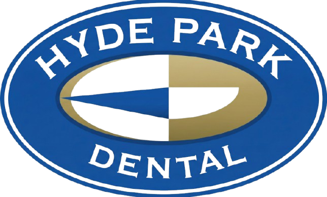

# 🦷 Hyde Park Dental Website

**Adelaide's trusted dental practice since 1983** - A modern, professional website showcasing comprehensive dental services and patient care.



## 🌟 Features

### **Modern Design**

- ✨ Stunning hero section with animated elements
- 🎨 Gradient accents and professional color scheme
- 📱 Fully responsive design (mobile, tablet, desktop)
- 🌓 Clean, accessible UI components

### **Interactive Components**

- 🔄 Before/After comparison sliders
- 📋 9 Interactive service detail dialogs
- 💬 27 Real patient testimonials with carousel
- 👥 Team member bio cards with hover effects
- ❓ Frequently Asked Questions dialog
- 🗺️ Integrated booking system

### **Booking Integration**

- 📅 Centaur Portal booking system integration
- 📞 Click-to-call phone links
- 🔗 14 booking entry points throughout the site
- 📱 Mobile-optimized booking flow

### **Sections**

1. **Hero** - Compelling introduction with contact info
2. **Features** - Why choose Hyde Park Dental
3. **Services** - Comprehensive service gallery
4. **Before/After** - Real patient transformations
5. **FAQs** - Common questions answered
6. **Testimonials** - Patient reviews and ratings
7. **Team** - Meet the dentists
8. **Footer** - Contact info, hours, social media

---

## 🛠️ Tech Stack

- **Framework:** React + TypeScript
- **Build Tool:** Vite
- **Runtime:** Bun
- **Styling:** Tailwind CSS
- **UI Components:** shadcn/ui + Radix UI
- **Animations:** Motion (Framer Motion)
- **Icons:** Lucide React

---

## 📦 Installation

### Prerequisites

- **Bun** (v1.0+) or npm/yarn/pnpm

### Setup

```bash
# Clone the repository
git clone https://github.com/YOUR_USERNAME/hyde-park-dental.git

# Navigate to directory
cd hyde-park-dental

# Install dependencies
bun install

# Start development server
bun run dev
```

The site will be available at `http://localhost:5173`

---

## 📁 Project Structure

```
hyde-park-dental/
├── public/
│   ├── logo.png
│   ├── team-hero.jpg
│   └── before-after/
├── src/
│   ├── components/
│   │   └── ui/
│   │       ├── hero-section-2.tsx
│   │       ├── services-gallery.tsx
│   │       ├── testimonial-card.tsx
│   │       ├── team-section.tsx
│   │       ├── footer-section.tsx
│   │       └── hyde-park-navbar.tsx
│   ├── lib/
│   │   ├── utils.ts
│   │   └── constants.ts
│   ├── App.tsx
│   ├── index.css
│   └── main.tsx
├── .gitignore
├── package.json
├── tailwind.config.js
└── vite.config.ts
```

---

## 🚀 Build & Deploy

### Build for Production

```bash
bun run build
```

### Preview Production Build

```bash
bun run preview
```

### Deploy to Vercel (Recommended)

```bash
# Install Vercel CLI
npm i -g vercel

# Deploy
vercel
```

Or connect your GitHub repository to Vercel for automatic deployments.

---

## 🎨 Customization

### Update Contact Information

Edit `src/lib/constants.ts`:

```typescript
export const PHONE_NUMBER = "08 8272 4855";
export const EMAIL = "hpdc@hydeparkdental.com.au";
export const ADDRESS = {
  street: "83 King William Road",
  suburb: "Hyde Park",
  state: "SA",
  postcode: "5061",
};
```

### Update Booking URL

Change the Centaur Portal booking link in `src/lib/constants.ts`:

```typescript
export const BOOKING_URL = "https://your-booking-system-url.com";
```

### Update Services

Edit service details in `src/components/ui/service-details-data.ts`

### Update Team Members

Edit team information in `src/components/ui/team-section.tsx`

---

## 📞 Contact Information

**Hyde Park Dental**

- 📍 83 King William Road, Hyde Park, SA 5061
- ☎️ (08) 8272 4855
- 📧 hpdc@hydeparkdental.com.au
- 🌐 hydeparkdental.com.au

**Hours:**

- Monday - Friday: 8:00 AM - 5:00 PM
- Saturday: By Appointment

---

## 📄 License

This project is proprietary and confidential.

---

## 🙏 Acknowledgments

- **shadcn/ui** for beautiful UI components
- **Radix UI** for accessible primitives
- **Tailwind CSS** for utility-first styling
- **Motion** for smooth animations

---

**Built with ❤️ for Hyde Park Dental**
